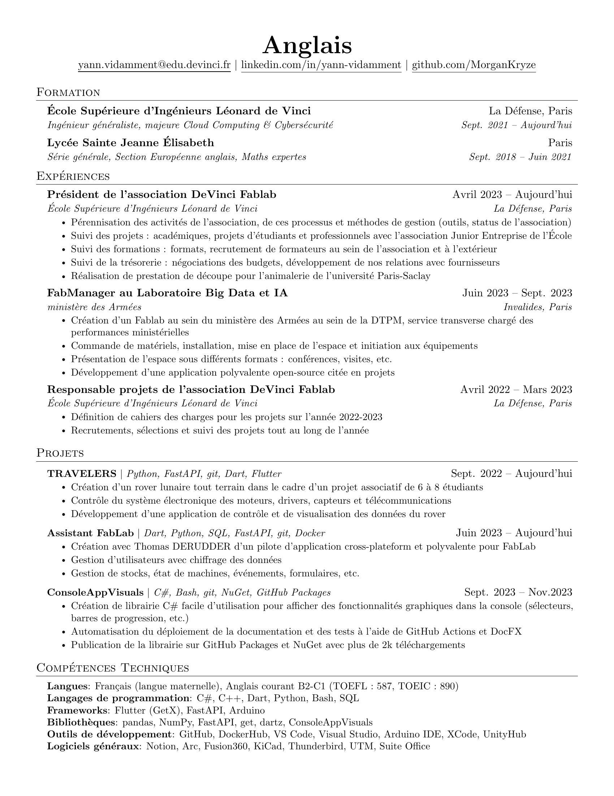

# Resume LaTeX template

> LaTeX easy-to-use template for tech resume that auto-build on a github page.




## Getting Started

### Prerequisites

To use this template, you will need to have LaTeX installed on your system. If you don't have LaTeX installed, you can use [Overleaf](https://www.overleaf.com/) to edit and compile the template.

Personally, I use LaTeX workshop extension for VSCode.

### Install

To use this template, you can either download the zip file or clone the repository:

```bash
git clone https://github.com/MorganKryze/Resume-LaTeX.git
```

### Usage

Once installed, it's pretty much it, just edit the `resume.tex` file to your liking and compile it automatically with LaTeX workshop. the outcome will be a `resume.pdf` file.

> If you encounter errors in the compilation, check that you have correctly installed all the libraries needed.

Then enter in the settings > pages : select "from branch", select "gh-pages" (create the branch if it does not exist), and select "/root". Now at every push, the pdf will be updated on your own github page [preview](https://morgankryze.github.io/Resume-LaTeX/).

If you want to only one language or two languages, you can update the `options.yml` file like this (only english) :

```yml
languages:
  - english
```

To create a qr-code, you can call the `qr-code.py` file:

```bash
python src/generate-qr-code.py
```

### Converting

If you want to use the convert.py file to convert your resume to a jpg or png file, you will need to install the dependencies with:

```bash
pip install -r requirements.txt
```

Then, according to your os, follow the instructions [here](https://pypi.org/project/pdf2image/).

Finally, you can run the script with:

```bash
python convert.py
```

This will convert your resume.pdf to a resume.jpg file (this is the manual way, you can also use the script to automatically convert your resume.pdf to a resume.jpg file at every push).

## Fork of

This fork is based off of [jakegut/resume](https://github.com/jakegut/resume).

Itself based off of [sb2nov/resume](https://github.com/sb2nov/resume/).

## License

This project is licensed under the MIT License - see the [LICENSE.md](LICENSE) file for details.
